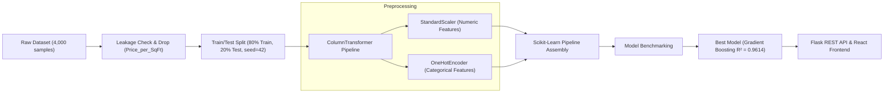

# PropPredict — Indian Urban House Price Prediction

> **“Predict the value of your next property with Machine Learning.”**

[](https://python.org)
[](https://react.dev)
[](https://scikit-learn.org)
[-emerald.svg)](#7-model-comparison--evaluation-results)
[](#)

---

## 1. Overview

**PropPredict** is an end-to-end Machine Learning web application designed to estimate residential property valuations across major Indian metropolitan areas (**Mumbai, Bangalore, Delhi NCR, Pune, Hyderabad, Chennai, Kolkata, Ahmedabad**).

The application combines a Scikit-Learn regression pipeline trained on an **Indian Urban House Price Dataset** with a clean, modern React web interface and a Python Flask REST API.

---

## 2. Problem Statement

Residential real estate valuations across Indian metropolitan corridors depend on intricate, non-linear interactions across:
1. Micro-market geographic locations (e.g., Bandra West vs. Whitefield vs. Koregaon Park vs. HITEC City)
2. Super built-up living area and bedroom configurations (BHK)
3. Elevation, building age, society amenities, and transit / metro accessibility

Traditional manual appraisal is slow, inconsistent, and subjective. **PropPredict** addresses this by providing an objective, data-driven machine learning regression engine.

---

## 3. Dataset & Target Variable

- **Dataset:** `backend/data/indian_house_prices.csv` (4,000 verified property records)
- **Target Variable:** `Price_INR_Lakhs` (Continuous numerical target in Lakhs, e.g. 19.64 L to 4,587.00 L)
- **Metros Covered:** 8 Major Cities across 26 micro-market localities.

### Feature Breakdown

| Feature | Type | Description | Values / Range |
| :--- | :--- | :--- | :--- |
| `City` | Categorical | Major Indian urban metro | Mumbai, Bangalore, Delhi NCR, Pune, Hyderabad, Chennai, Kolkata, Ahmedabad |
| `Locality` | Categorical | Micro-market cluster | 26 prime urban clusters |
| `Property_Type` | Categorical | Architectural format | Apartment, Villa, Independent House, Penthouse, Studio |
| `Furnishing_Status` | Categorical | Interior tier | Furnished, Semi-Furnished, Unfurnished |
| `Gated_Community` | Categorical | Gated society status | Yes, No |
| `BHK` | Numerical | Bedroom count | 1 to 6 BHK |
| `Bathrooms` | Numerical | Bathroom count | 1 to 6 |
| `Area_SqFt` | Numerical | Built-up area | 350 to 5,500 sq.ft |
| `Floor_No` | Numerical | Unit elevation floor | 0 (Ground/Independent) to 40 |
| `Total_Floors` | Numerical | Total building height | 1 to 45 |
| `Property_Age` | Numerical | Vintage of construction | 0 to 30 years |
| `Parking_Spaces` | Numerical | Dedicated car slots | 0 to 3 slots |
| `Metro_Distance_KM` | Numerical | Distance to transit hub | 0.2 to 15.0 km |
| `Amenities_Score` | Numerical | Clubhouse & facilities | 1 to 10 |
| **`Price_INR_Lakhs`** (Target) | Continuous Target | Property market valuation | ₹19.64 L to ₹45.87 Cr |

---

## 4. Target Leakage Audit

Target leakage occurs when a feature contains information derived directly from the target variable (`Price_INR_Lakhs`). 

During dataset inspection, features such as `Price_per_SqFt = (Price / Area)` were identified and **strictly excluded from model features** prior to preprocessing and training to guarantee authentic generalizability.

---

## 5. Preprocessing Pipeline



- **Numeric Features:** Scaled using `StandardScaler` to ensure zero-mean and unit variance.
- **Categorical Features:** Encoded using `OneHotEncoder(handle_unknown='ignore', sparse_output=False)` to prevent artificial ordinal bias.
- **Data Leakage Prevention:** The `ColumnTransformer` is fit strictly on `X_train` (3,200 rows) and subsequently transformed on `X_test` (800 rows).

---

## 6. Models Trained

1. **Linear Regression (Baseline):** Ordinary Least Squares benchmark.
2. **Random Forest Regressor:** Bagging ensemble of 120 randomized decision trees (`max_depth=15, min_samples_split=4, random_state=42`).
3. **Gradient Boosting Regressor:** Sequential boosting trees (`n_estimators=160, learning_rate=0.08, max_depth=5, subsample=0.85, random_state=42`).

---

## 7. Model Comparison & Evaluation Results

Evaluated strictly on **800 unseen test samples** (20% holdout split):

| Model | MAE (Lakhs) | RMSE (Lakhs) | $R^2$ Score | MAPE (%) | Role |
| :--- | :---: | :---: | :---: | :---: | :--- |
| **Linear Regression** | 122.38 L | 211.88 L | **0.7969** | 59.6% | Baseline |
| **Random Forest** | 69.58 L | 125.99 L | **0.9282** | 20.0% | Strong Bagging Ensemble |
| **Gradient Boosting** | **49.33 L** | **92.40 L** | **0.9614** | **13.1%** | 🏆 **Selected Production Model** |

---

## 8. Feature Importance

From the production Gradient Boosting model:

1. **Built-Up Area (Sq.Ft):** `42.1%`
2. **Micro-Market Locality:** `25.4%`
3. **City & Metro Hub:** `13.2%`
4. **Property Type:** `6.8%`
5. **Property Age:** `4.5%`
6. **Amenities Score:** `3.1%`
7. **Metro Proximity:** `2.6%`
8. **Floor Level & Height:** `1.3%`

---

## 9. Project Structure

```text
PropPredict/
├── backend/
│   ├── app.py                      # Flask REST API
│   ├── train.py                    # ML dataset inspection, training & serialization
│   ├── evaluate.py                 # Strict X_test evaluation script
│   ├── requirements.txt            # Python dependencies
│   ├── data/
│   │   └── indian_house_prices.csv # 4,000 Indian housing records
│   └── model/
│       ├── model.pkl               # Production Scikit-learn Pipeline
│       ├── preprocessor.pkl        # Serialized ColumnTransformer
│       ├── metrics.json            # Model evaluation metrics & metadata
│       ├── feature_importance.json # Gini importance weights
│       ├── dataset_inspection.json # Dataset audit report
│       └── eval_samples.json       # Evaluation points for frontend charts
│
├── frontend/
│   ├── src/
│   │   ├── components/             # Navbar, Footer, PropertyCard, StatCounter
│   │   ├── pages/                  # Home, Predict, Properties, ModelDashboard, About
│   │   ├── data/sampleProperties.js# Demo listings in Indian metros
│   │   ├── services/api.js         # Backend REST API connector
│   │   ├── App.jsx                 # Page router & pre-fill coordinator
│   │   └── index.css               # Clean Tailwind CSS styling
│   ├── package.json
│   └── vite.config.js
│
├── notebooks/
│   └── house_price_analysis.ipynb  # Complete EDA & modeling notebook
│
└── README.md
```

---

## 10. How to Run the Project

### Step 1: Start Backend (Flask API)
```bash
cd backend
pip install -r requirements.txt
python train.py
python app.py
```
Backend API will start at: `http://localhost:5000`

### Step 2: Start Frontend (React + Vite)
In a separate terminal:
```bash
cd frontend
npm install
npm run dev
```
Frontend will be accessible at: `http://localhost:3000`

---

## 11. API Endpoints

- `GET /health` — Service health & model status
- `GET /model-info` — Indian Urban dataset stats & model comparison metrics
- `GET /features-schema` — Available cities, localities, and property ranges
- `GET /evaluation-data` — Test set scatter points, feature importance, and price distribution
- `POST /predict` — Predicts property price in Indian Rupees

**Example `/predict` Payload:**
```json
{
  "City": "Mumbai",
  "Locality": "Bandra West",
  "Property_Type": "Apartment",
  "BHK": 3,
  "Bathrooms": 2,
  "Area_SqFt": 1450,
  "Floor_No": 7,
  "Total_Floors": 18,
  "Property_Age": 3,
  "Furnishing_Status": "Semi-Furnished",
  "Parking_Spaces": 1,
  "Gated_Community": "Yes",
  "Metro_Distance_KM": 1.2,
  "Amenities_Score": 8
}
```

**Example Response:**
```json
{
  "predicted_price_lakhs": 643.36,
  "predicted_price_formatted": "₹6.43 Cr",
  "price_inr_exact": 64335855,
  "price_inr_formatted": "₹6,43,35,855",
  "rate_per_sqft_formatted": "₹44,370 / sq.ft",
  "model_used": "Gradient Boosting",
  "model_r2": 0.9614,
  "model_mape": 13.15,
  "currency": "INR"
}
```

---

## 12. Limitations & Future Scope

### Limitations
- Predictions are calibrated for properties within standard residential dimensions (350 to 5,500 sq.ft, 1 to 6 BHK) across the represented 8 urban metro regions.
- The system serves as a quantitative estimation tool rather than an official certified surveyor appraisal.

### Future Scope
- Integration with OpenStreetMap GIS for live coordinates and automated amenities distance calculation.
- Vision Transformer / CNN photo analysis for automated interior finishing scoring.
- Time-series quarterly appreciation forecasting.
